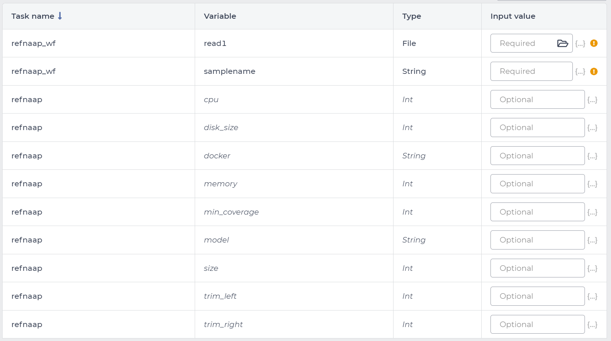

# RefNAAP-wdl

WDL wrapper around [RefNAAP](https://github.com/jiangweiyao/RefNAAP) for execution on [Terra.bio](https://terra.bio/).

## What is RefNAAP?

[RefNAAP](https://github.com/jiangweiyao/RefNAAP) is a reference based Oxford Nanopore Technologies (ONT) assembly analysis pipeline for RABV genomes. In summary, it performs the following steps:

1. t QCs the files using [fastQC](https://www.bioinformatics.babraham.ac.uk/projects/fastqc/) and [multiQC](https://multiqc.info/) to generate a quality report.
2. It trims the left and right ends of the reads by 25 basepairs, and filters out reads shorter than 50bp. These values can be costumized.
3. It generates the assembly reads using reference-based assembly with [minimap2](https://github.com/lh3/minimap2), gap fixing, and [medaka](https://github.com/nanoporetech/medaka).

It uses [a reference file composed of 14 different RABV sequences](https://github.com/jiangweiyao/RefNAAP/blob/main/Americas2.fasta) for the reference-based assembly.

## How do i use RefNAAP on Terra?

`RefNAAP-wdl` is available on [Terra.bio](https://terra.bio/), a cloud-native platform for researchers to access data, run analysis tools, and collaborate. With [Terra.bio](https://terra.bio/), you can easily process your data without prior knowledge of the command-line.

The following steps, assume you have already set up an account on [Terra.bio](https://terra.bio/) and created a workspace to work with `RefNAAP-wdl`.

### Import the workflow from Dockstore

To begin using `RefNAAP-wdl` on [Terra.bio](https://terra.bio/), you will need to import the workflow from [Dockstore](https://dockstore.org/), which is available at: [RefNAAP-wdl Dockstore Import](https://dockstore.org/workflows/github.com/theiagen/RefNAAP-wdl/RefNAAP-wdl:main?tab=info).

><p align="center">
>  
></p>
> Figure 1: RefNAAP-wdl on Dockstore.

Once you are on the Dockstore page for `RefNAAP-wdl`, you will want to locate the _Launch with_
section on the right side of the page and click on _Terra_.

><p align="center">
>  
></p>
> Figure 2: Launching a workflow with Terra.bio on Dockstore.

After clicking the _Terra_ button, you will be transported to [Terra.bio](https://terra.bio/). Once here you will decide on the _Destination Workspace_. Please select which of your workspaces you would like to import this workflow into. Once you have selected a _Destination Workspace_, all that remains is to click the _Import_ button.

><p align="center">
>  
></p>
> Figure 3: Importing workflow interface on Terra.bio. 

### Workflow configuration on Terra.bio

The `RefNAAP-wdl` should now be available in [Terra.bio](https://terra.bio/) on the **WORKFLOWS** tab. When clicking on the `RefNAAP-wdl` the workflow interface loads. On the workflow configuration section you will need to select the _Run workflow(s) with inputs defined by data table_. **`RefNAAP-wdl` is a sample-level workflow.**

><p align="center">
>  
></p>
> Figure 4: RefNAAP-wdl on Terra.bio.

#### Workflow inputs

Several inputs are available for workflow costumization: _required inputs_ that are necessary for execution, and _optional inputs_ that have default values but can be overwritten by the user.

>**Note:**
>To provide inputs from the data table, terra uses the `this.{column_name}` notation. For example, to pass the ONT reads that are in the `ont_read` column on the data table to the `read1` input, the value should be passed as `this.ont_reads`. 

><p align="center">
>  
></p>
> Figure 5: RefNAAP-wdl inputs.

Table 1: Input description for RefNAAP-wdl
| **Terra Task Name** | **Variable** | **Type** | **Description** | **Default Value** | **Terra Status** |
|---|---|---|---|---|---|
| refnaap_wf | **read1** | Base-called ONT read file in FASTQ file format (compressed) | DESCRIPTION | | Required |
| refnaap_wf | **samplename** | String | Name of sample to be analyzed | | Required |
| refnaap | **cpu** | Int | Number of CPUs to allocate to the task | 4 | Optional |
| refnaap | **disk_size** | Int | Amount of storage (in GB) to allocate to the task | 100 | Optional |
| refnaap | **docker** | String | The Docker container to use for the task | "us-docker.pkg.dev/general-theiagen/internal/refnaap:b3ad097" | Optional |
| refnaap | **memory** | Int | Amount of memory/RAM (in GB) to allocate to the task | 8 | Optional |
| refnaap | **min_coverage** | Int |  Amplicon regions need a minimum of this average coverage number | 5 | Optional |
| refnaap | **model** | String | Basecall model | "r10_min_high_g303" | Optional |
| refnaap | **size** | Int | Filter reads less than this length | 50 | Optional |
| refnaap | **trim_left** | Int | Bases to trim from left side of read | 25 | Optional |
| refnaap | **trim_right** | Int | Bases to trim from right side of read | 25 | Optional |

>**Note:** 
>Available basecall models:
>```bash
>r103_min_high_g345, r103_min_high_g360, r103_prom_high_g360, r103_prom_snp_g3210, r103_prom_variant_g3210, r10_min_high_g303, r10_min_high_g340, r941_min_fast_g303, r941_min_high_g303, r941_min_high_g330, r941_min_high_g340_rle, r941_min_high_g344, r941_min_high_g351, r941_min_high_g360, r941_prom_fast_g303, r941_prom_high_g303, r941_prom_high_g330, r941_prom_high_g344, r941_prom_high_g360, r941_prom_high_g4011, r941_prom_snp_g303, r941_prom_snp_g322, r941_prom_snp_g360, r941_prom_variant_g303, r941_prom_variant_g322, r941_prom_variant_g360
>```

#### Workflow outputs

The `RefNAAP-wdl` produces four outputs that are populated back to the data table.

><p align="center">
>  
></p>
> Figure 5: RefNAAP-wdl outputs.

| **Variable** | **Type** | **Description** |
|---|---|---|
| **refnaap_analysis_date** | String | Date of analysis with RefNAAP. |
| **refnaap_assembly_fasta** | File | Consensus assembly generated by RefNAAP in FASTA format. |
| **refnaap_docker** | String | Dockerfile used. |
| **refnaap_multiqc_report** | File | MultiQC report generated by RefNAAP in HTML format. |

## Contact

If you have any questions or concerns, please raise [a GitHub issue](https://github.com/theiagen/RefNAAP-wdl/issues) or email Theiagen's general support at support@theiagen.com.