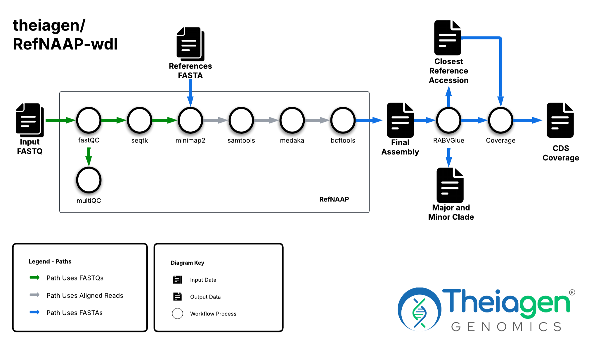
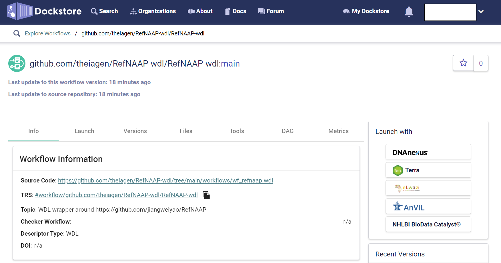
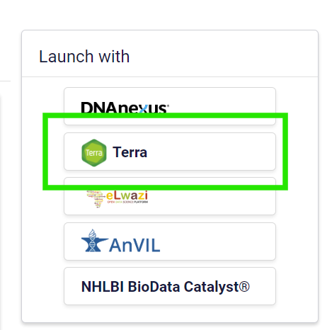
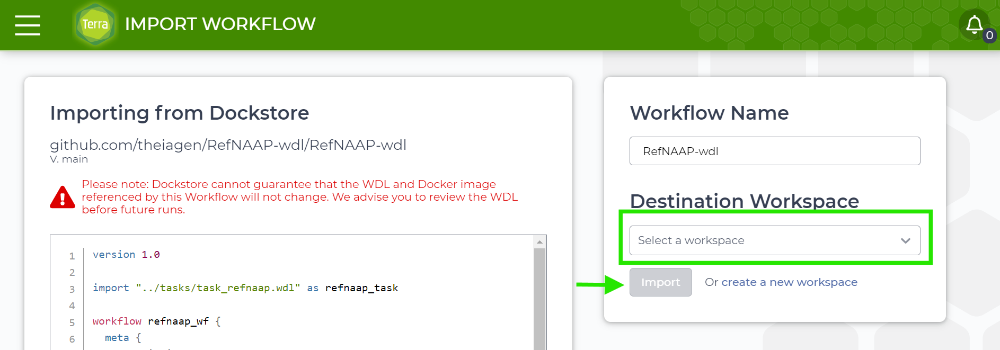
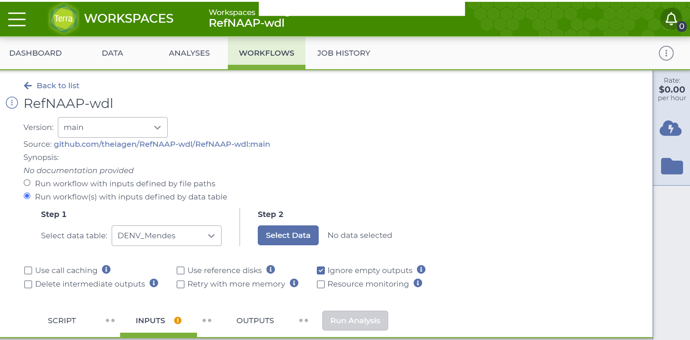
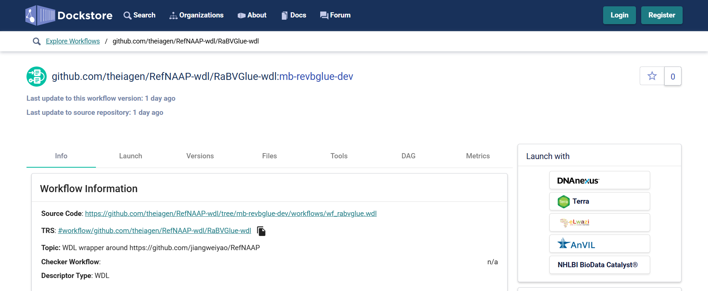
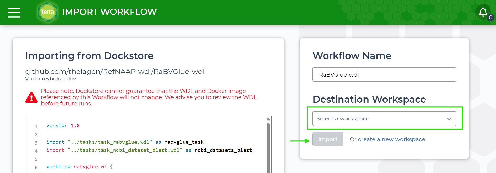
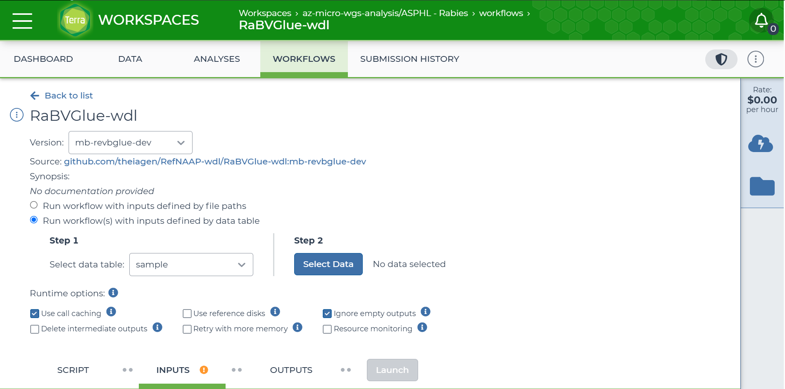

# RefNAAP-wdl

WDL wrapper around [RefNAAP](https://github.com/jiangweiyao/RefNAAP) and [RABV-GLUE](https://github.com/giffordlabcvr/RABV-GLUE) for execution on [Terra.bio](https://terra.bio/). Additionally, a custom Coding DNA Sequence (CDS) coverage calculation module is available for quality-control of the processed data.

><p align="center">
>  
></p>
> Figure 1: RefNAAP-wdl.

## Workflow components

### What is RefNAAP?

[RefNAAP](https://github.com/jiangweiyao/RefNAAP) is a reference based Oxford Nanopore Technologies (ONT) assembly analysis pipeline for RABV genomes. In summary, it performs the following steps:

1. It QCs the files using [fastQC](https://www.bioinformatics.babraham.ac.uk/projects/fastqc/) and [multiQC](https://multiqc.info/) to generate a quality report.
2. It trims the left and right ends of the reads by 25 basepairs, and filters out reads shorter than 50bp. These values can be customized.
3. It generates the assembly reads using reference-based assembly with [minimap2](https://github.com/lh3/minimap2), gap fixing, and [medaka](https://github.com/nanoporetech/medaka).

It uses [a reference file composed of 14 different RABV sequences](https://github.com/jiangweiyao/RefNAAP/blob/main/Americas2.fasta) for the reference-based assembly.

### What is RABV-GLUE?

[RABV-GLUE](https://github.com/giffordlabcvr/RABV-GLUE) is a sequence-oriented resource for comparative genomic analysis of rabies virus (RABV), developed using the [GLUE](https://github.com/giffordlabcvr/gluetools) software framework. It organises RABV genome sequence data along evolutionary lines, aiming to leverage new and existing RABV sequences in order to improve our understanding of the epidemiology and pathology of RABV. It provides the following information:

1. RABV Major Clade
2. RABV Minor Clade
3. Closest full genome accession in the RABV-GLUE database

### What is the custom coverage module?

To emulate the behaviour of [RABV-GLUE Online](http://rabv-glue.cvr.gla.ac.uk/#/home), a custom module was created that recieves the closest full genome accession and downloads it from [NCBI](https://www.ncbi.nlm.nih.gov/datasets/). This is then used to create a [BLAST] database for the calculation of coverage per CDS. A sequence is idenfitied as RABV if at least one CDS has over 75 percent coverage (default value, it can be adjusted). It produces the following information:

1. Identification of RABV sequence
2. Per CDS coverage (N, P, M, G and L)

## How do i use RefNAAP-wl on Terra?

`RefNAAP-wdl` is available on [Terra.bio](https://terra.bio/), a cloud-native platform for researchers to access data, run analysis tools, and collaborate. With [Terra.bio](https://terra.bio/), you can easily process your data without prior knowledge of the command-line.

The following steps, assume you have already set up an account on [Terra.bio](https://terra.bio/) and created a workspace to work with `RefNAAP-wdl`.

### Import the workflow from Dockstore

To begin using `RefNAAP-wdl` on [Terra.bio](https://terra.bio/), you will need to import the workflow from [Dockstore](https://dockstore.org/), which is available at: [RefNAAP-wdl Dockstore Import](https://dockstore.org/workflows/github.com/theiagen/RefNAAP-wdl/RefNAAP-wdl:main?tab=info).

><p align="center">
>  
></p>
> Figure 2: RefNAAP-wdl on Dockstore.

Once you are on the Dockstore page for `RefNAAP-wdl`, you will want to locate the _Launch with_
section on the right side of the page and click on _Terra_.

><p align="center">
>  
></p>
> Figure 3: Launching a workflow with Terra.bio on Dockstore.

After clicking the _Terra_ button, you will be transported to [Terra.bio](https://terra.bio/). Once here you will decide on the _Destination Workspace_. Please select which of your workspaces you would like to import this workflow into. Once you have selected a _Destination Workspace_, all that remains is to click the _Import_ button.

><p align="center">
>  
></p>
> Figure 4: Importing workflow interface on Terra.bio. 

### Workflow configuration on Terra.bio

The `RefNAAP-wdl` should now be available in [Terra.bio](https://terra.bio/) on the **WORKFLOWS** tab. When clicking on the `RefNAAP-wdl` the workflow interface loads. On the workflow configuration section you will need to select the _Run workflow(s) with inputs defined by data table_. **`RefNAAP-wdl` is a sample-level workflow.**

><p align="center">
>  
></p>
> Figure 5: RefNAAP-wdl on Terra.bio.

#### Workflow inputs

Several inputs are available for workflow costumization: _required inputs_ that are necessary for execution, and _optional inputs_ that have default values but can be overwritten by the user.

>**Note:**
>To provide inputs from the data table, terra uses the `this.{column_name}` notation. For example, to pass the ONT reads that are in the `ont_read` column on the data table to the `read1` input, the value should be passed as `this.ont_reads`. 

Table 1: Input description for RefNAAP-wdl
| **Terra Task Name** | **Variable** | **Type** | **Description** | **Default Value** | **Terra Status** |
|---|---|---|---|---|---|
| refnaap_wf | **read1** | File | Base-called ONT read file in FASTQ file format (compressed). | | Required |
| refnaap_wf | **samplename** | String | Name of sample to be analyzed. | | Required |
| ncbi_datasets_blast | **blast_evalue** | String | BLAST e-value threshold. | "1e-10" | Optional |
| ncbi_datasets_blast | **cpu** | Int | Number of CPUs to allocate to the task. | 4 | Optional |
| ncbi_datasets_blast | **disk_size** | Int | Amount of storage (in GB) to allocate to the task. | 50 | Optional |
| ncbi_datasets_blast | **docker** | String | The Docker container to use for the task. | "us-docker.pkg.dev/general-theiagen/theiagen/ncbi-datasets-blast:16.38.1_20250321" | Optional |
| ncbi_datasets_blast | **memory** | Int | Amount of memory/RAM (in GB) to allocate to the task. | 8 | Optional |
| ncbi_datasets_blast | **min_gene_coverage** | Float | Minimum percent coverage for BLAST to determine the persence of a CDS. | 75.0 | Optional |
| ncbi_datasets_blast | **min_percent_identity** | Float | Minimum percent identity for BLAST to determine the persence of a CDS. | 75.0 | Optional |
| rabv_genotype | **cpu** | Int | Number of CPUs to allocate to the task. | 4 | Optional |
| rabv_genotype | **disk_size** | Int | Amount of storage (in GB) to allocate to the task. | 50 | Optional |
| rabv_genotype | **docker** | String | The Docker container to use for the task. | "us-docker.pkg.dev/general-theiagen/theiagen/rabvglue:1.1.113_20250320" | Optional |
| rabv_genotype | **memory** | Int | Amount of memory/RAM (in GB) to allocate to the task. | 8 | Optional |
| refnaap | **cpu** | Int | Number of CPUs to allocate to the task. | 8 | Optional |
| refnaap | **disk_size** | Int | Amount of storage (in GB) to allocate to the task. | 100 | Optional |
| refnaap | **docker** | String | The Docker container to use for the task. | "us-docker.pkg.dev/general-theiagen/internal/refnaap:b3ad097" | Optional |
| refnaap | **memory** | Int | Amount of memory/RAM (in GB) to allocate to the task. | 16 | Optional |
| refnaap | **min_coverage** | Int |  Amplicon regions need a minimum of this average coverage number. | 5 | Optional |
| refnaap | **model** | String | Basecall model. | "r10_min_high_g303" | Optional |
| refnaap | **size** | Int | Filter reads less than this length. | 50 | Optional |
| refnaap | **trim_left** | Int | Bases to trim from left side of read. | 25 | Optional |
| refnaap | **trim_right** | Int | Bases to trim from right side of read. | 25 | Optional |

>**Note:** 
>Available basecall models:
>```bash
>r103_min_high_g345, r103_min_high_g360, r103_prom_high_g360, r103_prom_snp_g3210, r103_prom_variant_g3210, r10_min_high_g303, r10_min_high_g340, r941_min_fast_g303, r941_min_high_g303, r941_min_high_g330, r941_min_high_g340_rle, r941_min_high_g344, r941_min_high_g351, r941_min_high_g360, r941_prom_fast_g303, r941_prom_high_g303, r941_prom_high_g330, r941_prom_high_g344, r941_prom_high_g360, r941_prom_high_g4011, r941_prom_snp_g303, r941_prom_snp_g322, r941_prom_snp_g360, r941_prom_variant_g303, r941_prom_variant_g322, r941_prom_variant_g360
>```

>**Note:**
>When BLASTing to calculate the percent coverage of a given CDS, only the largest fragment that alignes is considered.

#### Workflow outputs

The `RefNAAP-wdl` produces several outputs that are populated back to the data table.

Table 2: Output description for RefNAAP-wdl
| **Variable** | **Type** | **Description** |
|---|---|---|
| **blast_results** | File | File containing the BLAST results. |
| **datasets_ncbi_docker** | String | Dockerfile used for the NCBI datasets module. |
| **datasets_ncbi_reference_fasta** | File | File, in FASTA format, with the closest full reference sequence identified by RABV-GLUE and used to create the BLAST database. |
| **datasets_ncbi_report** | File | Report file from NCBI Datasets for the reference sequence download. |
| **datasets_ncbi_version** | File | Version of NCBI Datasets used. |
| **G_percent_coverage** | Float | Percent coverage of the G CDS in the RABV genome. |
| **L_percent_coverage** | Float | Percent coverage of the L CDS in the RABV genome. |
| **M_percent_coverage** | Float | Percent coverage of the M CDS in the RABV genome. |
| **N_percent_coverage** | Float | Percent coverage of the N CDS in the RABV genome. |
| **P_percent_coverage** | Float | Percent coverage of the P CDS in the RABV genome. |
| **rabv_identified** | String | Indication that the sequence analysed has been identified as RABV. |
| **rabvglue_closest_reference** | String | Accession of the closest reference identified by RABV-GLUE. |
| **rabvglue_major_clade** | String | Major clade identified by RABV-GLUE. |
| **rabvglue_minor_clade** | String | Minor clade identified by RABV-GLUE. |
| **refnaap_analysis_date** | String | Date of analysis with RefNAAP. |
| **refnaap_assembly_fasta** | File | Consensus assembly generated by RefNAAP in FASTA format. |
| **refnaap_docker** | String | Dockerfile used for the RefNAAP module. |
| **refnaap_multiqc_report** | File | MultiQC report generated by RefNAAP in HTML format. |

---

# RABVGlue-wdl

The [RABV-GLUE](https://github.com/giffordlabcvr/RABV-GLUE) and custom Coding DNA Sequence (CDS) coverage calculation modules of the [RefNAAP-WDL](#refnaap-wdl) workflow are also available as it's own standalone workdlow for execution on [Terra.bio](https://terra.bio/). This allows for the analysis of RABV genomes that have been assembled through alternative methods, such as _de novo_ assembly. 

## How do i use RABVGlue-wl on Terra?

The following steps, assume you have already set up an account on [Terra.bio](https://terra.bio/) and created a workspace to work with `RABVGlue-wdl`.

### Import the workflow from Dockstore

To begin using `RABVGlue-wdl` on [Terra.bio](https://terra.bio/), you will need to import the workflow from [Dockstore](https://dockstore.org/), which is available at: [RABVGlue-wdl Dockstore Import](https://dockstore.org/workflows/github.com/theiagen/RefNAAP-wdl/RaBVGlue-wdl:mb-revbglue-dev?tab=info).

><p align="center">
>  
></p>
> Figure 6: RABVGlue-wdl on Dockstore.

Once you are on the Dockstore page for `RABVGlue-wdl`, you will want to locate the _Launch with_
section on the right side of the page and click on _Terra_.

><p align="center">
>  
></p>
> Figure 7: Launching a workflow with Terra.bio on Dockstore.

After clicking the _Terra_ button, you will be transported to [Terra.bio](https://terra.bio/). Once here you will decide on the _Destination Workspace_. Please select which of your workspaces you would like to import this workflow into. Once you have selected a _Destination Workspace_, all that remains is to click the _Import_ button.

><p align="center">
>  
></p>
> Figure 8: Importing workflow interface on Terra.bio. 

### Workflow configuration on Terra.bio

The `RABVGlue-wdl` should now be available in [Terra.bio](https://terra.bio/) on the **WORKFLOWS** tab. When clicking on the `RABVGlue-wdl` the workflow interface loads. On the workflow configuration section you will need to select the _Run workflow(s) with inputs defined by data table_. **`RABVGlue-wdl` is a sample-level workflow.**

><p align="center">
>  
></p>
> Figure 5: RABVGlue-wdl on Terra.bio.

#### Workflow inputs

Several inputs are available for workflow costumization: _required inputs_ that are necessary for execution, and _optional inputs_ that have default values but can be overwritten by the user.

>**Note:**
>To provide inputs from the data table, terra uses the `this.{column_name}` notation. For example, to pass the ONT reads that are in the `ont_read` column on the data table to the `read1` input, the value should be passed as `this.ont_reads`. 

Table 1: Input description for RefNAAP-wdl
| **Terra Task Name** | **Variable** | **Type** | **Description** | **Default Value** | **Terra Status** |
|---|---|---|---|---|---|
| rabvglue_wf | **assembly_fasta** | File | FASTA file with the RABV sequence to be analyzed. | | Required |
| ncbi_datasets_blast | **blast_evalue** | String | BLAST e-value threshold. | "1e-10" | Optional |
| ncbi_datasets_blast | **cpu** | Int | Number of CPUs to allocate to the task. | 4 | Optional |
| ncbi_datasets_blast | **disk_size** | Int | Amount of storage (in GB) to allocate to the task. | 50 | Optional |
| ncbi_datasets_blast | **docker** | String | The Docker container to use for the task. | "us-docker.pkg.dev/general-theiagen/theiagen/ncbi-datasets-blast:16.38.1_20250321" | Optional |
| ncbi_datasets_blast | **memory** | Int | Amount of memory/RAM (in GB) to allocate to the task. | 8 | Optional |
| ncbi_datasets_blast | **min_gene_coverage** | Float | Minimum percent coverage for BLAST to determine the persence of a CDS. | 75.0 | Optional |
| ncbi_datasets_blast | **min_percent_identity** | Float | Minimum percent identity for BLAST to determine the persence of a CDS. | 75.0 | Optional |
| rabv_genotype | **cpu** | Int | Number of CPUs to allocate to the task. | 4 | Optional |
| rabv_genotype | **disk_size** | Int | Amount of storage (in GB) to allocate to the task. | 50 | Optional |
| rabv_genotype | **docker** | String | The Docker container to use for the task. | "us-docker.pkg.dev/general-theiagen/theiagen/rabvglue:1.1.113_20250320" | Optional |
| rabv_genotype | **memory** | Int | Amount of memory/RAM (in GB) to allocate to the task. | 8 | Optional |

>**Note:**
>When BLASTing to calculate the percent coverage of a given CDS, only the largest fragment that alignes is considered.

#### Workflow outputs

The `RABVGlue-wdl` produces several outputs that are populated back to the data table.

Table 2: Output description for RefNAAP-wdl
| **Variable** | **Type** | **Description** |
|---|---|---|
| **blast_results** | File | File containing the BLAST results. |
| **datasets_ncbi_docker** | String | Dockerfile used for the NCBI datasets module. |
| **datasets_ncbi_reference_fasta** | File | File, in FASTA format, with the closest full reference sequence identified by RABV-GLUE and used to create the BLAST database. |
| **datasets_ncbi_report** | File | Report file from NCBI Datasets for the reference sequence download. |
| **datasets_ncbi_version** | File | Version of NCBI Datasets used. |
| **G_percent_coverage** | Float | Percent coverage of the G CDS in the RABV genome. |
| **L_percent_coverage** | Float | Percent coverage of the L CDS in the RABV genome. |
| **M_percent_coverage** | Float | Percent coverage of the M CDS in the RABV genome. |
| **N_percent_coverage** | Float | Percent coverage of the N CDS in the RABV genome. |
| **P_percent_coverage** | Float | Percent coverage of the P CDS in the RABV genome. |
| **rabv_identified** | String | Indication that the sequence analysed has been identified as RABV. |
| **rabvglue_closest_reference** | String | Accession of the closest reference identified by RABV-GLUE. |
| **rabvglue_major_clade** | String | Major clade identified by RABV-GLUE. |
| **rabvglue_minor_clade** | String | Minor clade identified by RABV-GLUE. |

---

# Contact

If you have any questions or concerns, please raise [a GitHub issue](https://github.com/theiagen/RefNAAP-wdl/issues) or email Theiagen's general support at support@theiagen.com.
